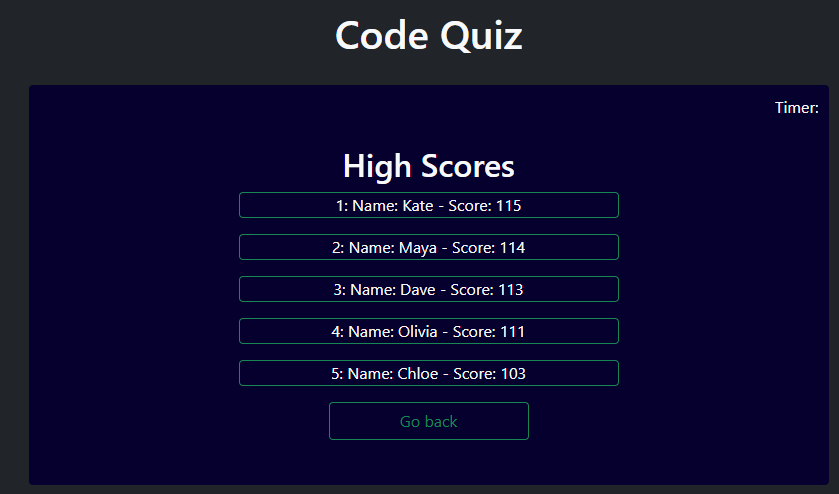

# Code Quiz

This project uses web API methods to generate a 5 question quiz for the user to complete. This quiz also has a timer, which counts down as soon as the user begins,
and decreases by 10 for every wrong answer. Once the quiz is done, the final score is whatever time is left on the timer. The user then has the choice to add this to a highscore table. If the timer reaches zero, the game is over and the user lost but can restart. The highscore table works with local storage and ranks by highest score.

## Possible Improvements

* randomize the multiple choice answers (given my code setup, this shouldn't be hard)

## Getting Started

Just press the start quiz button to start the challenge!

## Deployed Link

* [See Live Site](https://emdorgan.github.io/code-quiz/)

## Screenshots

## Built With

* [HTML](https://developer.mozilla.org/en-US/docs/Web/HTML)
* [CSS](https://developer.mozilla.org/en-US/docs/Web/CSS)
* [Javascript](https://developer.mozilla.org/en-US/docs/Web/JavaScript)
* [Bootstrap](https://getbootstrap.com/)

## Authors

* **Emily Dorgan** 

- [Link to Portfolio Site](https://emdorgan.github.io/portfolio/)
- [Link to Github](https://github.com/emdorgan)
- [Link to LinkedIn](https://www.linkedin.com/in/emily-dorgan/)

## License

This project is licensed under the MIT License